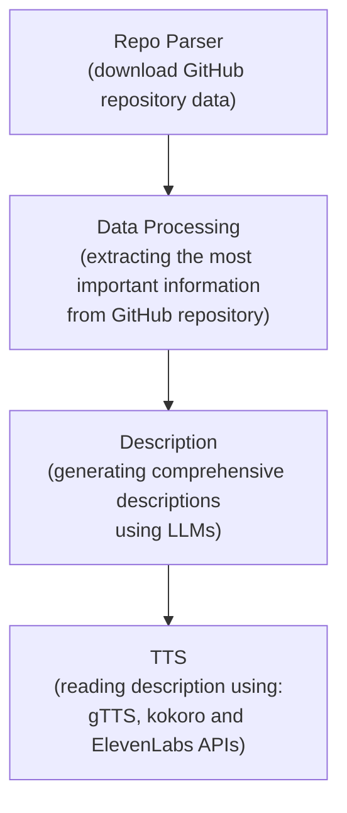

# Skryba | Repo description Generator

> [!NOTE]
> This repo is a copy of [original repository](https://github.com/knsiczarnamagia/wave4-skryba)on which the project was developed. 

The project was implemented by members of [Czarna Magia](https://github.com/knsiczarnamagia) AI society.


## Description
Skryba is an application that intelligently analyzes GitHub repositories. It fetches and processes repository data for key insights, then leverages LLMs to generate concise repository description descriptions. These descriptions are brought to life as audio narrations using TTS APIs (gTTS, Kokoro, and ElevenLabs).

## Skryba Pipeline

## How to install and run the Project locally
**Prerequisites:**
Ensure you have [Poetry (Python dependency manager)](https://python-poetry.org/docs/) and [Make](https://makefiletutorial.com/) installed. You'll also need Git to clone the repository.

**Steps:**

1.  **Clone the repository (if you haven't already):**
    ```bash
    git clone https://github.com/knsiczarnamagia/wave4-skryba.git
    ```

2.  **Set up API Keys:**
    This project requires API keys. Create a `.env` file in the project root (you can copy from an `.env.example` and add your necessary API keys.

3.  **Install dependencies:**
    In your terminal, within the project directory, run:
    ```bash
    make install
    ```
    *(This command should handle Poetry environment creation and dependency installation via the Makefile).*

4.  **Run the application:**
    ```bash
    make run-app
    ```
## Used Stack

*   **Core & ML:** Python (~3.12), Langchain, OpenAI API
*   **Text-to-Speech (TTS):** gTTS, ElevenLabs API, Kokoro
*   **Data & APIs:** PyGithub, Pydantic, Requests
*   **Testing & Quality:** Pytest, Ruff, Mypy
*   **Dev Tools:** Poetry, Git & GitHub
*   **Project Organization:** GitHub Projects


## Skryba team:
- [Bartlomiej Chmielewski](https://github.com/Bart140)
- [Kamil Chorzelewski](https://github.com/elkamill0)
- [Kacper Gutowski](https://github.com/Perunio)
- [Piotr Ostaszewski](https://github.com/PET3R12)
- [Konrad Nowakowski](https://github.com/NowakowskiKonrad)
- [Jan Karaś](https://github.com/KTFish)
